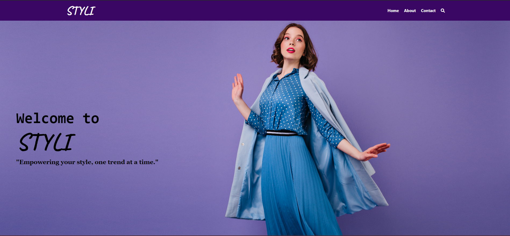
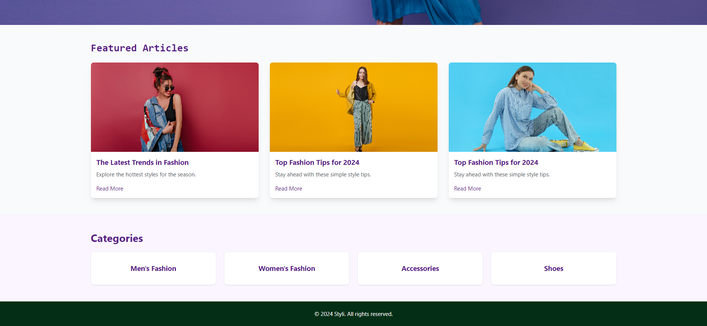

# Styli - A Fashion Blog Website

Styli is a beautifully designed landing page for a fashion blog that showcases the latest trends, featured articles, and categorized content in a stylish manner. It is built with modern web technologies like Tailwind CSS and Vite, ensuring a responsive and fast experience.

---

## Styli Landing Page
The Styli landing page offers:
- An elegant hero section with a captivating background image and welcoming text.
- Featured articles with attractive cards and hover effects.
- Categories section to explore various fashion domains.
- A responsive navigation bar and footer for seamless interaction.

---

## Features
1. **Responsive Design**: Works seamlessly across devices.
2. **Modern Aesthetic**: Styled using Tailwind CSS for clean and modern visuals.
3. **Dynamic Navigation**: Intuitive navigation bar with hover effects.
4. **Reusable Components**: Designed with modular components for flexibility.

---

## Project Structure

```
Styli/
├── index.html      # Main HTML file
├── style.css       # Custom styles
├── assets/         # Contains images used in the project
│   ├── emotional-brunette-woman.jpg
│   ├── happy-dark.jpg
│   ├── full-length-portrait-slim-stylish-girl.jpg
│   └── concept-people.jpg
```

---

## How to Use

### Clone the Repository
To get started, clone the repository to your local machine:
```bash
git clone https://github.com/DevX-007/styli.git
cd styli
```

### Setup and Run
Styli uses **Vite** for development and **Tailwind CSS** (PostCSS) for styling. Follow these steps:
1. Install dependencies:
   ```bash
   npm install
   ```

2. Start the development server:
   ```bash
   npm run dev
   ```

3. Open the project in your browser by navigating to the provided local URL.

---

## Preview
Add screenshots and video demos of the working application here. This section can contain:
- 
- 
- A video showcasing the navigation and responsiveness.
<video width="600" controls>
  <source src="preview/Stylipreview.mp4" type="video/mp4">
  Your browser does not support the video tag.
</video>

---

## Contact
**Author**: Himanshu  
**GitHub**: [DevX-007](https://github.com/DevX-007)

